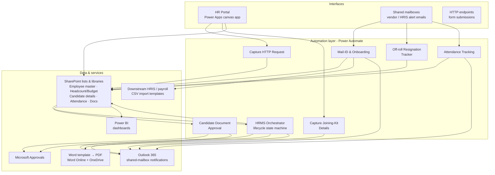
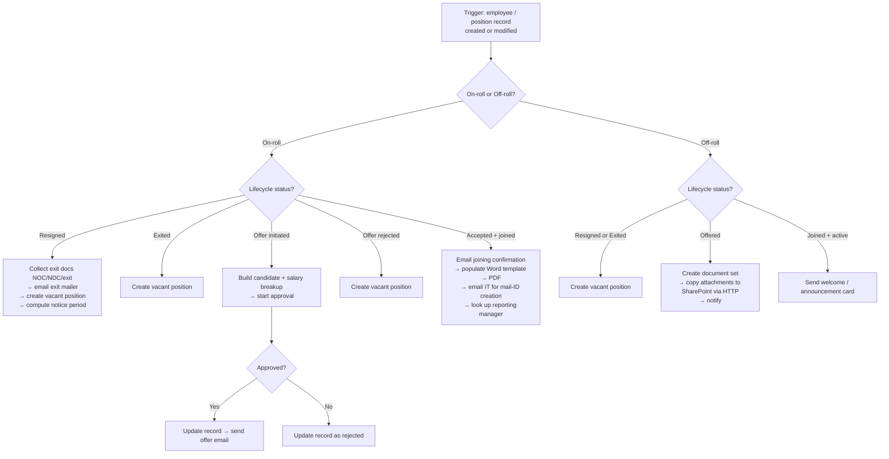

# HRMS on Microsoft Power Platform - Architecture & Case Study

A production HR management system I designed and built **end-to-end, solo**, on the
Microsoft Power Platform - SharePoint as the data layer, a Power Apps canvas app as
the front end, **Power Automate as the automation/orchestration layer**, and Power BI
for reporting. It runs the full employee lifecycle for an enterprise HR team: hiring,
onboarding, separation, headcount, attendance, and downstream HRIS integration.

This repository is a **sanitized architecture case study**. It documents *how the system
is designed and how the automation works* - it contains no company data, no
credentials, no tenant/site identifiers, and no runnable solution package. See
[Sanitization & scope](#sanitization--scope).

> **Tech:** Power Apps (canvas) · Power Automate · SharePoint Online · Microsoft
> Approvals · Outlook 365 · Word Online + OneDrive (document generation) · Power BI

---

## The problem

The team ran hiring, onboarding, and full-and-final settlement across **11
person-dependent Excel trackers** and **8 disconnected intake forms**. Status lived in
people's inboxes, handoffs were manual, and there was no single source of truth for a
position or an employee's lifecycle state. Turnaround was slow and error-prone, and
nothing was auditable.

## What I built

A single SharePoint-backed system where every position/employee record has a
**lifecycle state**, and a set of Power Automate flows react to state changes and
inbound signals to do the work automatically - routing approvals, generating documents,
creating vacancies, notifying stakeholders, and syncing to the downstream HRIS.

## Reported outcomes

| Metric | Before | After | Change |
| --- | --- | --- | --- |
| Hiring turnaround | 5 days | 1 day | **−80%** |
| Full-and-final settlement | 30 days | 10 days | **−66%** |
| Person-dependent Excel trackers | 11 | 0 | consolidated |
| Onboarding intake forms | 8 | 1 portal | unified |

---

## System architecture



**Design choice - SharePoint as the state store.** Each position/employee row carries a
lifecycle status (on-roll / off-roll × offered / accepted / joined / resigned / exited).
The orchestrator treats that status as the single source of truth and is *event-driven*:
it fires on create/modify and branches on state, so the same record can move through its
whole lifecycle without any flow needing to "remember" context between runs.

**CURRENTLY WORKING ON UPDATING THE FLOWS WITH BETTER REPRESENTATION AND EXPLAINATION**
---

## The flows

Seven Power Automate flows make up the automation layer. Full per-flow breakdowns with
diagrams are in **[docs/FLOWS.md](docs/FLOWS.md)**.

| Flow | Trigger | What it does | Key connectors |
| --- | --- | --- | --- |
| **HRMS Orchestrator** | SharePoint item created/modified | The lifecycle state machine - routes hiring approvals, generates the offer + mail-ID documents, creates vacancies on separation, and posts onboarding announcements, for both on-roll and off-roll employees | SharePoint, Approvals, Outlook, Word Online, OneDrive, Office 365 Users |
| **Candidate Document Approval** | File created/modified in a document library | Sends an approval for an uploaded candidate document; on approve/reject sets SharePoint content-approval status and notifies via shared mailbox | SharePoint, Approvals, Outlook |
| **Mail-ID & Onboarding** | New joiner alert email | Parses the joiner email, matches the record, generates the standard HRIS import templates (biographical, person-info, employment history, job history, e-code UDF) as CSV files, and requests mail-ID creation | SharePoint, Outlook, HTML→text conversion |
| **Off-roll Resignation Tracker** | Resignation alert email (staffing vendor) | Extracts the employee ID and resignation date from the vendor email and updates the headcount/budget list | SharePoint, Outlook, HTML→text conversion |
| **Attendance Tracking** | Attendance data email | Parses the attendance payload, writes rows to the attendance list, and replies with a confirmation adaptive card | SharePoint, Outlook |
| **Capture HTTP Request** | HTTP request (called from the app) | Endpoint that updates an employee interaction on an actionable card (outlook) and emails a joining confirmation - lets the Power App trigger server-side work | SharePoint, Outlook |
| **Capture Joining-Kit Details** | HTTP request (called from the app) | Lightweight endpoint that captures joining-kit form details and sends a confirmation | Outlook |

---

## How the orchestrator works

The flagship flow is a nested decision tree over the employee lifecycle. Simplified:



---

## Engineering-realism notes

- **Event-driven, stateless flows.** State lives on the SharePoint record, not in the
  flow. Any run can pick up a record at whatever stage it's in - which is what lets one
  orchestrator cover the entire lifecycle instead of a chain of brittle hand-offs.
- **Human-in-the-loop where it counts.** Offers and candidate documents route through
  Microsoft Approvals and only mutate state on an explicit decision; rejections notify
  the right stakeholders instead of dead-ending.
- **Document generation, not attachments.** Offer / mail-ID paperwork is produced by
  populating a Word template and converting to PDF, so output is consistent and
  branded rather than hand-assembled.
- **Downstream-system realism.** The onboarding flow emits the exact CSV import
  templates Successfactor & HGS expects, so joiners flow through without re-keying.
- **Signals from the real world.** Several flows are driven by inbound mails
  emails (resignations, attendance, joiners) - parsed HTML→text, normalized, and matched
  back to records.
- **Idempotency-minded writes.** Lookups (get-items → apply-to-each → patch) are scoped
  so a re-trigger updates the intended record rather than duplicating it.

---

## Repository structure

```
.
├── README.md                     ← this case study
└── docs/
    ├── FLOWS.md                  ← per-flow breakdowns with diagrams
    └── diagrams/                 ← Mermaid source for each diagram
        ├── system-architecture.mmd
        ├── hrms-orchestrator.mmd
        ├── candidate-document-approval.mmd
        ├── mail-id-onboarding.mmd
        ├── offroll-resignation-tracker.mmd
        ├── attendance-tracking.mmd
        ├── capture-http-request.mmd
        └── capture-joining-kit.mmd
```

---

## Sanitization & scope

This repo is documentation, produced from **sanitized** flow exports:

- **Removed:** tenant and SharePoint site URLs, all real email addresses, list/library
  GUIDs, connection references, and environment identifiers.
- **Generalized:** list names, mailbox names, and organization-specific policy logic are
  described by role/function, not reproduced verbatim.
- **Not included:** any employee data, any credentials, and any importable solution
  package - nothing here can be deployed against the original system.

The intent is to show *architecture and engineering approach* only.
