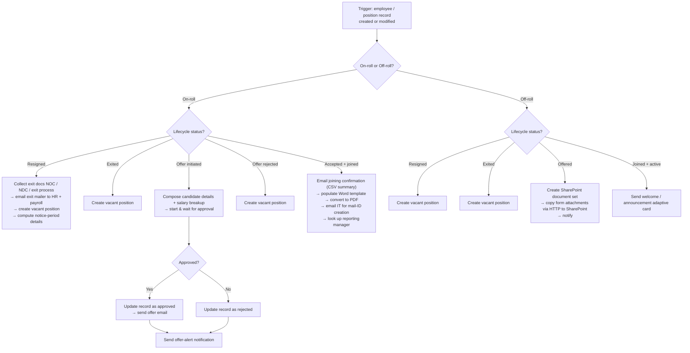
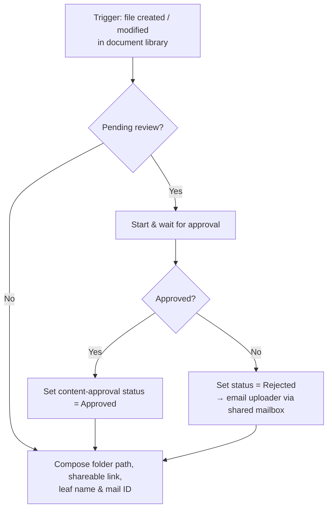
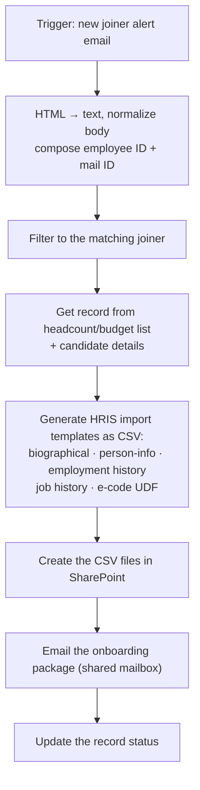
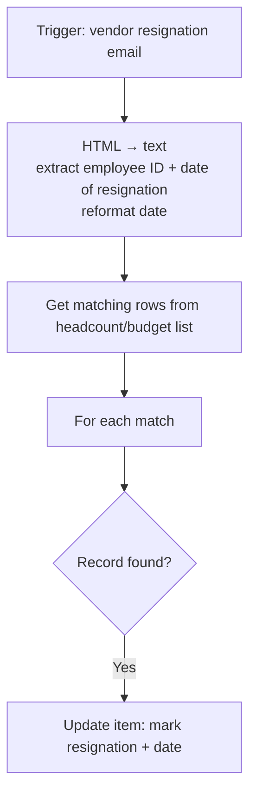
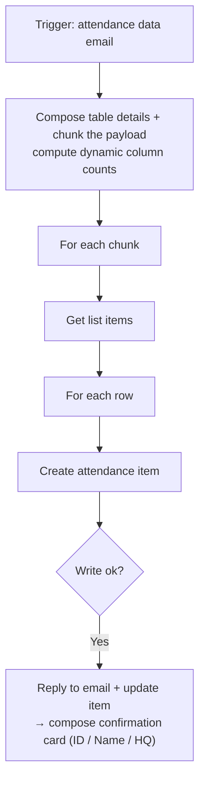
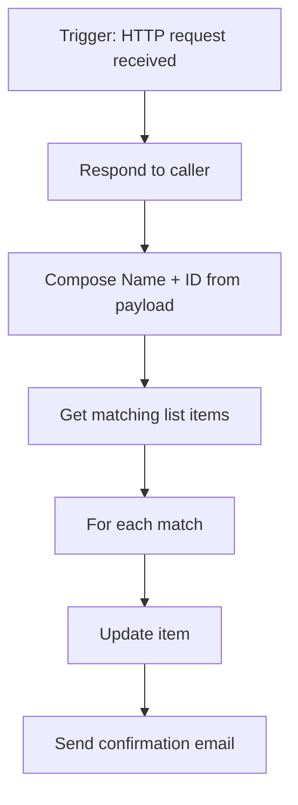
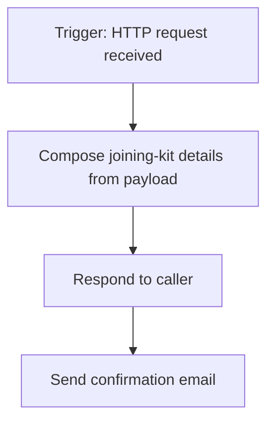

# Flows — detailed breakdown

Seven Power Automate flows make up the HRMS automation layer. Each section below gives
the trigger, what the flow does, and a diagram. All names, mailboxes, and lists are
described by role/function; identifiers and data have been removed.

- [1. HRMS Orchestrator](#1-hrms-orchestrator)
- [2. Candidate Document Approval](#2-candidate-document-approval)
- [3. Mail-ID & Onboarding](#3-mail-id--onboarding)
- [4. Off-roll Resignation Tracker](#4-off-roll-resignation-tracker)
- [5. Attendance Tracking](#5-attendance-tracking)
- [6. Capture HTTP Request](#6-capture-http-request)
- [7. Capture Joining-Kit Details](#7-capture-joining-kit-details)

---

## 1. HRMS Orchestrator

**Trigger:** a SharePoint employee/position item is created or modified.
**Role:** the lifecycle state machine for the whole system. It branches first on
employment type (on-roll vs off-roll), then on lifecycle status, and performs the right
action — approvals, document generation, vacancy creation, or notifications.

**Connectors:** SharePoint · Approvals · Outlook (shared mailbox) · Word Online ·
OneDrive · Office 365 Users.

---

## 2. Candidate Document Approval

**Trigger:** a file is created or modified in the candidate-documents library.
**Role:** routes each uploaded document through an approval, then stamps SharePoint's
content-approval status and notifies on rejection.

**Connectors:** SharePoint · Approvals · Outlook (shared mailbox).

---

## 3. Mail-ID & Onboarding

**Trigger:** a new-joiner alert email arrives in a shared mailbox.
**Role:** turns an inbound joiner email into the downstream HRIS import files and the
mail-ID onboarding request.

**Connectors:** SharePoint · Outlook · HTML-to-text conversion.

---

## 4. Off-roll Resignation Tracker

**Trigger:** a resignation alert email from the staffing vendor.
**Role:** keeps the headcount/budget list current for contract (off-roll) staff without
manual entry.

**Connectors:** SharePoint · Outlook · HTML-to-text conversion.

---

## 5. Attendance Tracking

**Trigger:** an attendance-data email arrives.
**Role:** parses the attendance payload into a SharePoint list and confirms back to the
sender with an adaptive card.

**Connectors:** SharePoint · Outlook.

---

## 6. Capture HTTP Request

**Trigger:** an HTTP request (invoked from the Power Apps front end).
**Role:** a server-side endpoint that lets the app update a record and send a
confirmation email in one call.

**Connectors:** SharePoint · Outlook.

---

## 7. Capture Joining-Kit Details

**Trigger:** an HTTP request (invoked from the Power Apps front end).
**Role:** a lightweight endpoint that captures joining-kit form details and emails a
confirmation.

**Connectors:** Outlook.

